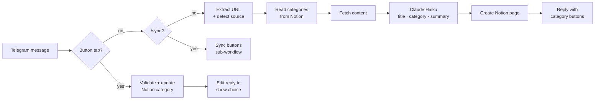

# Dev Links

A personal "read-later" pipeline: send a link to a Telegram bot and it lands in a Notion database, categorized and summarized by Claude, with one-tap buttons to change the category.

It replaces the habit of emailing/sending links to yourself and organizes them in one consolidated place. Send a Twitter/X post, Reddit thread, GitHub repo or article, and a few seconds later the bot replies with a title, a one-line summary and the category it filed the link under.

```
You ─▶ Telegram bot ─▶ n8n ─▶ fetch content ─▶ Claude Haiku ─▶ Notion
                        ▲                                        │
                        └──────── reply + category buttons ◀─────┘
```

## How it works



1. **Capture.** You send a URL to the bot, optionally with a category name on the next line to skip the AI's choice.
2. **Fetch.** n8n pulls readable content for the link type (see [Content fetching](#content-fetching)).
3. **Categorize and summarize.** Claude Haiku gets the content and the live list of Category options from Notion, and returns a title, a category, a one-sentence summary and up to three key points as JSON.
4. **Save.** A page is created in the Notion database right away with the AI's pick.
5. **Confirm or change.** The bot replies with the summary and one button per category. Tapping a button updates the Notion page and edits the reply to show your choice.

## Tech stack

| Layer | Technology |
| --- | --- |
| Workflow engine | [n8n](https://n8n.io) 2.x, self-hosted in Docker Desktop |
| Public ingress | [Tailscale Funnel](https://tailscale.com/kb/1223/funnel), exposing only n8n's `/webhook` path over HTTPS |
| Chat interface | Telegram Bot API (webhook trigger, inline keyboards, callback queries) |
| AI | Anthropic Claude Haiku 4.5 (`claude-haiku-4-5`) via n8n's Anthropic node |
| Storage | Notion database (Notion API `2022-06-28`) |
| Content sources | fxtwitter API, Reddit JSON, GitHub REST API, plain HTML |

## Workflows

All three live in [`workflows/`](workflows) and can be imported into n8n.

| File | Purpose |
| --- | --- |
| `dev-links.json` | Main workflow: Telegram trigger, content fetch, Claude, Notion save, category buttons, button taps and the `/sync` command |
| `sync-category-buttons.json` | Keeps the Telegram buttons in step with the Notion Category options. Runs daily at 06:00 and on `/sync` |
| `error-alert.json` | Error workflow: sends a Telegram alert if any run crashes outright |

## Integrations

### Telegram
- A single **Telegram Trigger** subscribes to `message` and `callback_query` updates, and an IF node routes each update to the link, button-tap or `/sync` path.
- Replies thread to your original message (`reply_to_message_id`).
- Category buttons are an inline keyboard. Each button's `callback_data` is `c|<notion page id>|<category name>`, so a tap carries everything needed to update the right page, with no extra state storage.

### Content fetching
| Source | Detected by | Fetched from |
| --- | --- | --- |
| Twitter/X | `x.com`, `twitter.com` + `/status/<id>` | `api.fxtwitter.com/status/<id>` (free, unofficial). The original x.com URL is what gets saved |
| Reddit | `*.reddit.com` | `<thread>.json`: post body and top 5 comments |
| GitHub | `github.com/<owner>/<repo>` | GitHub REST API README (raw) |
| Article | anything else | The page HTML, stripped to title, meta description and text |

The fetched text is capped at 8,000 characters. If a fetch fails or returns almost nothing, Claude works from the URL and your message alone, and the reply says so.

### Claude (Anthropic)
- The system prompt asks for one JSON object: `title`, `category` (must be one of the provided options), `summary` (one sentence, 25 words or fewer) and `keyPoints`.
- The response parser extracts the first balanced JSON object, so stray prose or code fences around it don't break the run.
- If the model returns a category that isn't in Notion, it falls back to `Other` (or the first option). Category never creates new Notion select options.

### Notion
- **Read:** the Category options are read live from the database schema on every run and every button tap.
- **Create:** a page is created with Title, URL, Category, Summary, Key Points, Source, Added and Status (`To Read`).
- **Update:** a button tap PATCHes only the `Category` property.
- The **Notes** property is never written. It's reserved for your own progress notes.

### Category button sync
Telegram's node in n8n can't build a variable number of buttons at run time, and sending them through the Bot API directly would mean storing the bot token outside n8n's encrypted credential store. Instead, the sync workflow:

1. reads the Category options from Notion,
2. fetches the Dev Links workflow through the n8n REST API,
3. rewrites the button list on the reply node if the categories changed, then saves and republishes it,
4. messages you on Telegram with the result.

Category names must be 29 characters or fewer to fit Telegram's 64-byte `callback_data` limit. Longer names are skipped and reported.

## Notion database schema

| Property | Type | Written by |
| --- | --- | --- |
| Title | Title | Claude |
| URL | URL | Original link |
| Category | Select | Claude, then your button tap |
| Summary | Text | Claude |
| Key Points | Text | Claude |
| Source | Select | Detected from the URL (Twitter/X, Reddit, GitHub, Article) |
| Added | Date | Time saved |
| Status | Select | `To Read` on creation |
| Notes | Text | You only |

## Setup

### 1. Run n8n in Docker
```bash
docker run -d --name dev-links-n8n --restart unless-stopped \
  -p 5678:5678 \
  -v ~/.n8n:/home/node/.n8n \
  -e WEBHOOK_URL=https://<machine>.<tailnet>.ts.net/ \
  -e N8N_PROXY_HOPS=1 \
  n8nio/n8n
```

### 2. Expose only the webhook path with Tailscale Funnel
Enable MagicDNS, HTTPS certificates and Funnel for your tailnet, then run:
```bash
tailscale funnel --bg --set-path /webhook http://localhost:5678/webhook
```
The n8n editor stays private. Only `https://<machine>.<tailnet>.ts.net/webhook/...` is public.

### 3. Create credentials in n8n
| Credential | Type | Notes |
| --- | --- | --- |
| Telegram account | Telegram API | Bot token from [@BotFather](https://t.me/BotFather) |
| Anthropic account | Anthropic | API key from console.anthropic.com |
| Notion account | Notion API | Internal integration token. Share the database with the integration |
| n8n API (local) | n8n API | An n8n API key, with base URL `http://localhost:5678/api/v1` |

### 4. Import the workflows
Import all three JSON files, pick your credentials on each node, and replace the placeholders:

| Placeholder | Where | Value |
| --- | --- | --- |
| `YOUR_NOTION_DATABASE_ID` | Dev Links, Sync | The database ID from its Notion URL |
| `YOUR_TELEGRAM_CHAT_ID` | Sync, Error Alert | Your chat ID (visible in any Telegram Trigger execution as `message.chat.id`) |
| `YOUR_DEV_LINKS_WORKFLOW_ID` | Sync | The imported Dev Links workflow's ID |
| `YOUR_SYNC_WORKFLOW_ID` | Dev Links (Run Sync node) | The imported sync workflow's ID |

Then, in the workflow settings of **Dev Links** and **Sync Category Buttons**, set **Error workflow** to **Dev Links – Error Alert**. Activate Dev Links and Sync Category Buttons.

### 5. First run
Send `/sync` to your bot to build the category buttons, then send it a link.

## Usage

| You send | What happens |
| --- | --- |
| `https://...` | Saved with the AI's category. Reply includes category buttons |
| `https://...` + a category name on the next line | Saved with that category, and the AI's pick is ignored |
| Tap a category button | Notion page updated, and the reply edited to show your choice |
| `/sync` | Buttons refreshed from Notion immediately |
| Text without a link | "No link found" reply, and nothing is saved |

## Error handling

Every step has an error route that replies on Telegram with the failed step and error message. The error workflow covers anything that escapes those routes, such as crashes and timeouts. The only silent failures are when the host machine, Docker or Tailscale is down, in which case Telegram retries delivery for up to 24 hours, or when Telegram itself is unavailable.

## Limitations

- **Twitter/X** relies on the unofficial fxtwitter API. Long threads may be only partly captured.
- **Paywalled or JavaScript-rendered articles** return little text, so the summary falls back to the URL.
- **The host PC must be on** for links to be processed.
